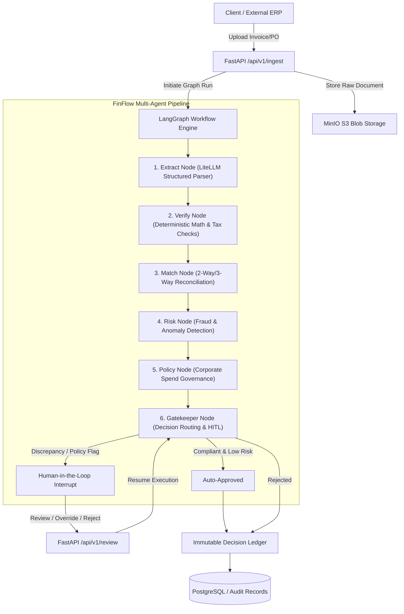

# FinFlow 💸

> **Intelligent Multi-Agent Financial Document Ingestion, Reconciliation, Risk Assessment, and Policy Compliance Engine**

FinFlow is a high-throughput, enterprise-ready financial workflow automation platform. Powered by **LangGraph** and **LiteLLM**, FinFlow processes financial documents (Invoices, Purchase Orders, Receipts), performs mathematical audits, 3-way matching, fraud/anomaly detection, spending policy governance, and records all actions into an **Immutable SHA-256 Decision Ledger**.

---

## 🏛️ System Architecture



---

## ⚡ Key Features

1. **Multi-Agent LangGraph Workflow**:
   - `extract`: Multi-modal structured JSON extraction with LiteLLM.
   - `verify`: Strict arithmetic validation (subtotals, tax calculations, discounts, currency matching).
   - `match`: 2-way and 3-way matching against POs and Goods Receipts with configurable tolerance.
   - `risk`: Anomaly and fraud detection (duplicate invoices, bank detail changes, price surge flags, velocity alerts).
   - `policy`: Approval matrix enforcement ($5k / $25k / $100k limits, preferred vendors, restricted categories).
   - `gatekeeper`: Dynamic routing with state checkpointing & Human-in-the-Loop (HITL) interrupt.
2. **Immutable Decision Ledger**:
   - Cryptographically linked SHA-256 audit blocks capturing full reasoning, validation matrices, human overrides, and state snapshots.
3. **FastAPI Endpoints**:
   - Document upload & ingestion (`/api/v1/ingest`)
   - Human review queue & actions (`/api/v1/review`)
   - Ledger chain verification & query (`/api/v1/ledger`)
4. **Resilient Architecture**:
   - Works seamlessly with both PostgreSQL and SQLite (local dev), MinIO/S3, and LiteLLM with structured output fallbacks.

---

## 🚀 Quick Start

### 1. Prerequisites & Environment
Ensure Python 3.10+ is installed.

```bash
# Clone and enter directory
cd finflow

# Install dependencies
pip install -e .
```

### 2. Configure Environment
Copy `.env.example` to `.env`:
```bash
cp .env.example .env
```

### 3. Launch Services (Optional Docker Stack)
```bash
docker-compose up -d
```

### 4. Run API Server
```bash
uvicorn src.api.main:app --reload --port 8000
```

Interactive API documentation will be available at [http://localhost:8000/docs](http://localhost:8000/docs).

---

## 🧪 Running Tests

```bash
python -m pytest tests -v
```
